# Conditional GANs (cGAN) for Fashion MNIST

## Objective
This project focuses on implementing Conditional Generative Adversarial Networks (cGAN) in PyTorch to generate  fashion images similar to the Fashion MNIST dataset. Through this project, we can generate specific types of clothes from the dataset such as shirts, pants, shoes, and many more by conditioning on class labels.

## Dataset
Fashion MNIST (28x28 grayscale images, 10 classes):
Downloaded automatically via Torchvision

### Exploratory Data Analysis


#### Data Distribution
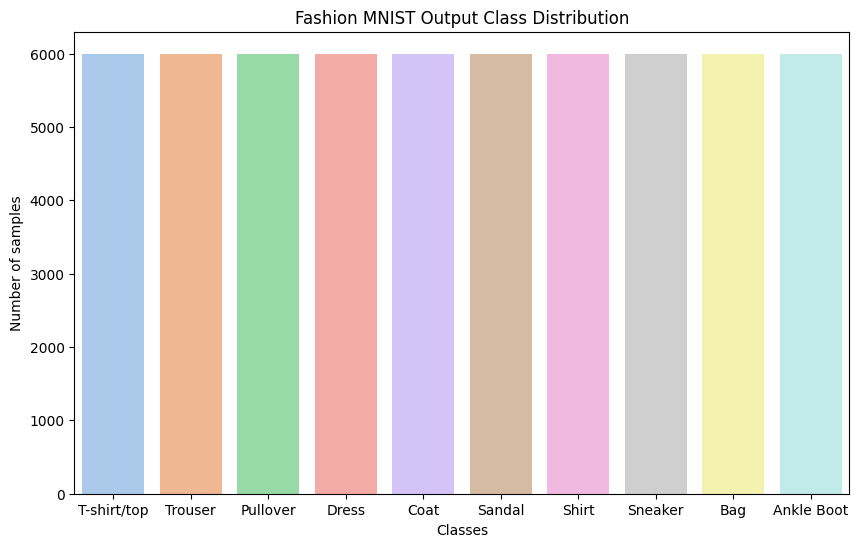

## CGAN Generated Images
### GIF of CGAN Generated Images (During Training)
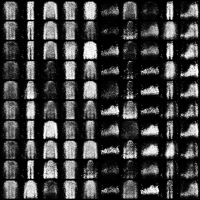

### Generated Image: Across All Labels
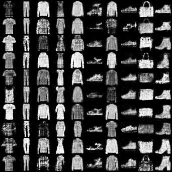

### Generated Images of T-shirts/ Tops
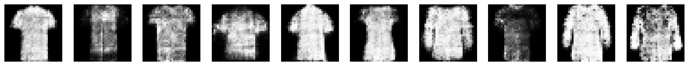

### Generated Images of Trousers
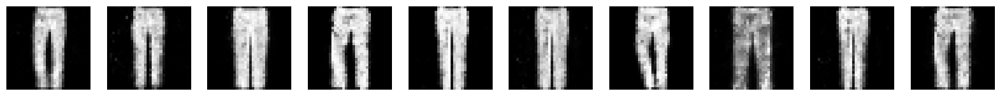

### Generated Images of Pullovers
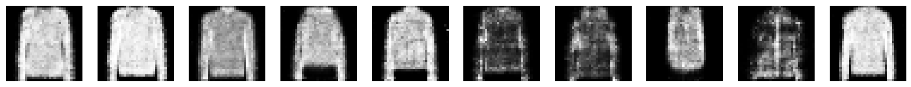

### Generated Images of Dresses
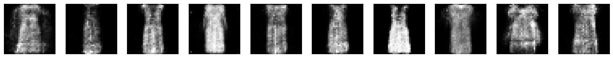

### Generated Images of Coats
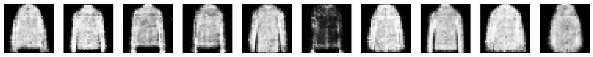

### Generated Images of Sandals
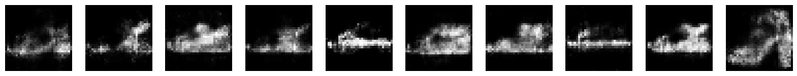

### Generated Images of Shirts
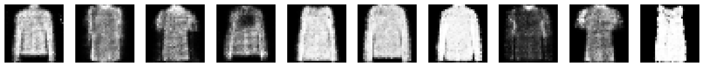

### Generated Images of Sneakers
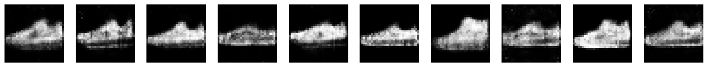

### Generated Images of Bags
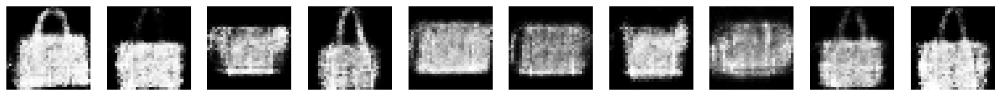

### Generated Images of Ankle Boots
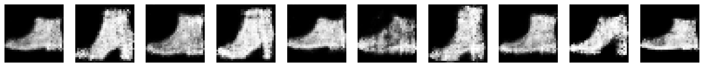

## Conclusion
This project shows how we can solve one major issue with traditional GANs- the controllability of the output. Through Conditional GANs, we have successfully trained the discriminator and the generators to take ‘y’ label as an input which is used to help generate specific types of image outputs.

## Installation
To run this project, I used Python 3.10.10 and PyTorch. Install dependencies using:
```bash
pip install -r requirements.txt
```

## How to Run
This project can be run in a Jupyter Notebook.
Steps:
1. Clone the repository and navigate to the project directory:
    ```
    git clone https://github.com/rkaushick-neu/cgans/
    cd cgans
    ```
2. Install required dependencies:
    ```bash
    pip install -r requirements.txt
    ```
3. Open the Jupyter notebook:
    ```bash
    jupyter notebook Rish_CGANs.ipynb
    ```
4. Run all the cells to train the model and generate class specific fashion images.

## Author
Rishabh Kaushick

For any questions, feel free to reach out via GitHub Issues.